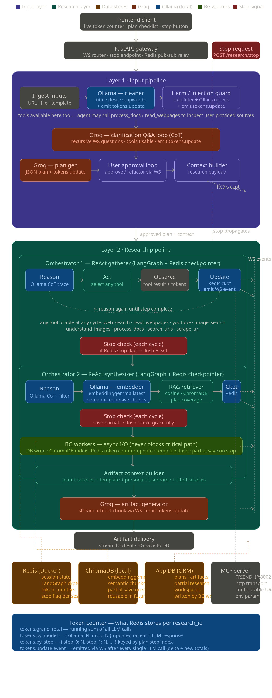
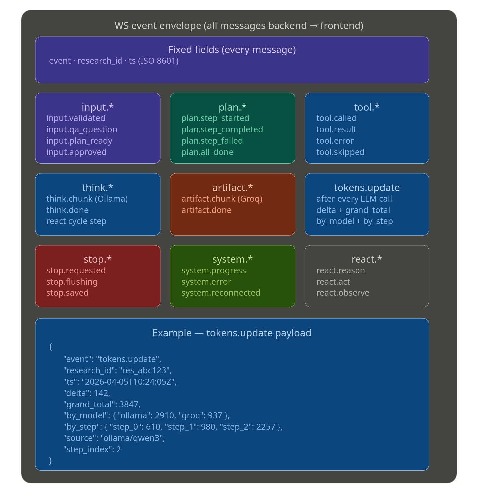

# Deep-Researcher: Agentic RAG Excellence

Deep-Researcher is a high-performance, agentic RAG (Retrieval-Augmented Generation) system designed for deep intelligence gathering across multiple data sources. It leverages advanced orchestration frameworks and a multimodal brain to plan, execute, and synthesize complex research tasks.

## 🏗️ System Architecture

The project follows a **layered microservice architecture** with clear separation between frontend, API gateway, orchestration layer, and storage.

### 1. Interface Tier (Frontend UI)
- **Desktop Application**: Built with **Vite + React** (using shadcn/ui components).
- **Real-time Collaboration**: Frontend polling for agent progress and streaming outputs.

### 2. API Gateway (BFF - Backend for Frontend)
- **Framework**: Python **FastAPI** with **Gevent** workers.
- **Responsibilities**:
  - API endpoint management
  - Ability to handle file uploads (PDF, DOCX, TXT)
  - Real-time progress updates
  - Streaming research outputs
  - Export API (PDF, Word, CSV, Excel)

### 3. Orchestration & Agent Layer
- **Frameworks**: **LangChain**, **LlamaIndex**, and **LangFlow** for visual agent workflows.
- **User Config Manager**: Handles RSPY Toggle, Source Selection, Depth Level, Report Preferences.
- **Background Task Queue**: Async task execution with progress tracking.

#### Specialized Agents
- **Web Research Agent**: Uses **Crawl4AI** (DuckDuckGo) for autonomous web crawling.
- **YouTube Research Agent**: Extracts and transcribes video content using **Python API**.
- **Document Retrieval Agent**: Parses PDFs, DOCX, and TXT files.
- **Image Metadata Agent**: Analyzes visual content for additional context.

### 4. Data Ingestion & Processing
- **Trace Email Handler**: Ingests email threads for research.
- **Document Parser**: Multi-format support (PDF, DOCX, TXT).
- **Audio Transcriber**: **Whisper** integration for voice/video transcription.
- **Realtime Research Server**: High-end GPU/Laptop server for real-time inference.

### 5. The Brain (LLMs)
- **Generative Agent**: **Ollama** (Local LLM) for reasoning and synthesis.
- **Cloud Fallback**: **OpenAI GPT-4**, **Google Gemini**, **Anthropic Claude**.

### 6. Storage & Persistence Layer

#### SQLite Databases
- **brain.db**: Core knowledge storage.
- **history.db**: User interaction logs and session history.
- **scrapes.db**: Cached web scrapes and crawl data.
- **research.db**: Completed research tasks and reports.
- **assets.db**: Metadata for images, files, and attachments.
- **export.db**: Export job tracking and archived outputs.

#### Vector & Memory Stores
- **Vector Store**: **ChromaDB** for semantic search and RAG retrieval.
- **Raw Data Store**: **File System** for unprocessed documents and media.
- **Metadata Store**: **SQLite** for structured metadata.

#### Context Management
- **Context Builder**: Constructs prompts from vector store + raw data.
- **LlamaIndex**: Handles semantic chunking and embedding generation.

### 7. Export & Output System
- **Research Document Generator**: Produces structured reports.
- **Export Formats**: PDF, Word (`.docx`), Plain Text, CSV, Excel.
- **Research History Manager**: Tracks previous queries and generated outputs.
- **Session Logs**: Full audit trail of agent reasoning and tool use.

---

## 🔄 Agentic Reasoning Flow

1. **User Query Analysis**: Parse intent, configure RSPY (Research, Synthesis, Planning, YouTube) toggles.
2. **Unified Research Request**: Route to appropriate agents based on config.
3. **Parallel Agent Execution**:
   - Web Research Agent → Crawl4AI → Scrapes DB
   - YouTube Agent → Transcription → Assets DB
   - Document Agent → Parser → Research DB
   - Image Agent → Metadata Extraction
4. **Data Annotation & Vectorization**: Chunk, embed, and store in ChromaDB.
5. **Context Building**: Retrieve top-K relevant chunks + metadata.
6. **LLM Synthesis**: Generate coherent research report with citations.
7. **Export & Storage**: Save to Research DB, offer multi-format export.

---

## 🛠️ Implementation Roadmap

### Phase 1: Backend & Storage Foundation
- [ ] Set up FastAPI with BFF pattern and Gevent workers.
- [ ] Initialize **6 SQLite databases** (brain, history, scrapes, research, assets, export).
- [ ] Configure **ChromaDB** for vector storage.
- [ ] Set up file system storage for raw data.
- [ ] Integrate **Ollama** for local LLM inference.

### Phase 2: Agent & Tool Integration
- [ ] Implement **Crawl4AI** for web research (DuckDuckGo integration).
- [ ] Build **YouTube Research Agent** with transcription (Whisper).
- [ ] Create **Document Parser** (PDF/DOCX/TXT support).
- [ ] Develop **Image Metadata Agent**.
- [ ] Set up **Email Handler** (Trace integration).
- [ ] Configure **LangChain/LlamaIndex/LangFlow** orchestration.

### Phase 3: User Interface & Export System
- [ ] Build React frontend with Vite + Shadcn UI.
- [ ] Implement real-time progress tracking and streaming.
- [ ] Create **Export System** (PDF, Word, CSV, Excel).
- [ ] Build **Research History Manager** UI.
- [ ] Add **RSPY Toggle** configuration panel.


---

## 📁 Project Structure

Unlike the earlier monolithic version where all logic lived in 2 files, this architecture emphasizes clean separation of concerns.

Deep-Researcher/
│
├── backend/                    # Python FastAPI Backend (BFF Pattern)
│   ├── main/
│   │   ├── __init__.py
│   │   ├── main.py             # FastAPI app initialization (Gevent)
│   │   ├── config.py           # Environment & RSPY Toggle settings
│   │   └── routes/             # API endpoints
│   │       ├── research.py     # Research task endpoints
│   │       ├── upload.py       # File upload handling
│   │       ├── export.py       # Export API (PDF/Word/CSV/Excel)
│   │       └── health.py       # Health checks
│   │
│   ├── agents/                 # Specialized Research Agents
│   │   ├── web_research.py     # Crawl4AI-based web agent
│   │   ├── youtube_agent.py    # Video transcription agent
│   │   ├── document_agent.py   # PDF/DOCX/TXT parser
│   │   ├── image_metadata.py   # Image analysis agent
│   │   └── orchestrator.py     # LangChain/LlamaIndex/LangFlow coordinator
│   │
│   ├── tools/                  # External integrations
│   │   ├── crawl4ai_client.py  # Crawl4AI wrapper (DuckDuckGo)
│   │   ├── whisper_client.py   # Audio transcription (Whisper)
│   │   ├── trace_email.py      # Email ingestion
│   │   └── youtube_api.py      # YouTube data extraction
│   │
│   ├── parsers/                # Document processors
│   │   ├── pdf_parser.py       # PDF extraction
│   │   ├── docx_parser.py      # Word document parsing
│   │   └── text_parser.py      # Plain text ingestion
│   │
│   ├── storage/                # Database & file system managers
│   │   ├── databases/          # SQLite database schemas
│   │   │   ├── brain.db        # Core knowledge
│   │   │   ├── history.db      # Session logs
│   │   │   ├── scrapes.db      # Web scrape cache
│   │   │   ├── research.db     # Completed reports
│   │   │   ├── assets.db       # Media metadata
│   │   │   └── export.db       # Export jobs
│   │   ├── vector_store.py     # ChromaDB manager
│   │   ├── file_system.py      # Raw data storage handler
│   │   └── context_builder.py  # LlamaIndex context assembly
│   │
│   ├── export/                 # Report generation
│   │   ├── pdf_generator.py    # PDF export
│   │   ├── word_generator.py   # DOCX export
│   │   ├── csv_generator.py    # CSV export
│   │   └── excel_generator.py  # XLSX export
│   │
│   ├── llm/                    # Model abstraction layer
│   │   ├── ollama_client.py    # Local LLM (Ollama)
│   │   ├── gemini_client.py    # Google Gemini
│   │   ├── openai_client.py    # OpenAI GPT
│   │   └── claude_client.py    # Anthropic Claude
│   │
│   ├── queue/                  # Background task management
│   │   ├── task_queue.py       # Async job queue
│   │   └── progress_tracker.py # Real-time progress updates
│   │
│   └── requirements.txt        # Python dependencies
│
├── app/                        # Vite + React Frontend
│   ├── src/
│   │   ├── components/         # React components
│   │   │   ├── ChatInterface.tsx
│   │   │   ├── AgentViewer.tsx     # Real-time agent thoughts
│   │   │   ├── HistoryPanel.tsx    # Research history browser
│   │   │   ├── ExportDialog.tsx    # Export format selector
│   │   │   ├── ConfigPanel.tsx     # RSPY Toggle UI
│   │   │   └── SourcePanel.tsx     # Citations & evidence
│   │   │
│   │   ├── hooks/              # Custom React hooks
│   │   │   ├── useResearch.ts      # API integration
│   │   │   ├── useStreaming.ts     # SSE/WebSocket
│   │   │   └── useProgress.ts      # Progress tracking
│   │   │
│   │   └── lib/                # Utilities
│   │       ├── api.ts              # Backend client
│   │       ├── markdown.ts         # Rendering utilities
│   │       └── export.ts           # Export helpers
│   │
│   └── package.json
│
└── README.md                   # This file
```

### Key Organization Principles
1. **Backend Modularity**: Each agent, tool, and storage layer has its own module.
2. **Storage Separation**: 6 SQLite databases for different data types + ChromaDB for vectors + file system for raw data.
3. **Export System**: Dedicated module for multi-format report generation.
4. **BFF Pattern**: FastAPI acts as a backend-for-frontend with specialized endpoints.
5. **Frontend Component Isolation**: UI components are separated from business logic (hooks).
6. **Configuration Management**: All secrets, API keys, and RSPY toggles in `.env` files.
7. **Testability**: Each module can be unit-tested independently.

---

## 🚀 Getting Started

1. **Prerequisites**: Python 3.12+, Node.js 20+, Ollama, Redis.
2. **Setup**:
   ```bash
   # Backend
   cd backend
   pip install -r requirements.txt
   
   # Frontend
   cd app
   npm install
   npm run dev
   ```
Perfect. Now I have everything. Let me map all the changes before drawing:

1. **Token tracking** — three-level counter: grand total, per-model (Ollama vs Groq), per-step. Every LLM call (including tool-internal ones) emits a `tokens.update` WS event with a delta. Redis stores the running counters so reconnects restore the live total instantly.

2. **ReAct + Chain of Thought** — Ollama runs ReAct loop (Reason → Act → Observe → Reason...) inside both orchestrators, not just Orc1. Tools are available at any phase — clarification, synthesis, anywhere. CoT is the reasoning trace emitted as `think.chunk` events.

3. **Tools available everywhere** — no phase lock. The agent can call `understand_images`, `process_docs`, `read_webpages` at any point — including during plan approval clarification if it needs to read a URL the user provided.

4. **Redis checkpointed at every meaningful step** — every ReAct cycle, every tool result, every token delta writes to Redis. LangGraph uses Redis as its checkpointer backend directly.

5. **Stop research** — graceful cancellation: signal propagates through LangGraph → MCP calls cancelled → gathered sources flushed to DB via BG worker → ChromaDB partial index saved → Redis state marked `stopped` → WS event sent. Partial knowledge is reusable.Now the updated WS event schema with the new event types:Here's every change and the reasoning behind each:







**ReAct is now the execution model for both orchestrators**, not just a label. Each LangGraph cycle is formally Reason → Act → Observe → Update. The "Reason" step is Ollama's CoT trace streamed as `think.chunk` events. "Act" can call any tool at any point in the pipeline — there is no phase lock. If Ollama decides during synthesis that it needs to re-scrape a URL or understand an image to resolve ambiguity, it just acts. "Observe" collects the tool result plus the token count it returned. "Update" writes the checkpoint to Redis and fires the WS event — all before the next reason cycle starts.

**Redis is checkpointed after every single ReAct cycle**, not just per plan step. LangGraph's checkpointer backend is wired directly to Redis so resuming a session just replays from the last committed node — mid-step, mid-tool-call, anywhere. Every token counter delta is also written atomically to the same Redis key so a reconnecting client gets the current totals instantly via `system.reconnected`.

**Stop signal flow** — `POST /research/stop` sets a `stop_flag` key in Redis for that `research_id`. Every ReAct cycle checks this flag before starting a new reason step. When detected: the current tool call is allowed to finish (no hard kill), LangGraph exits its loop, BG workers flush everything gathered so far to both ChromaDB and DB with status `partial`, and three `stop.*` events are fired in sequence so the frontend can show "stopping → saving → saved". Partial vectors in ChromaDB are stored with a metadata tag `partial: true, research_id: X` so future researches can query and reuse them.

**Token tracking** — every LLM response (Ollama or Groq) returns a token count. The pattern is: extract `usage.prompt_tokens + usage.completion_tokens` from the response, compute delta, offload the Redis increment to a BG worker (non-blocking), and immediately fire `tokens.update` on the WS with the delta + all three counter levels. The frontend never has to request the count — it just accumulates the deltas as they arrive.

Ready to write code. Where do you want to start — the Redis session manager + checkpoint schema, the FastAPI WS router, or the LangGraph ReAct graph scaffold?
